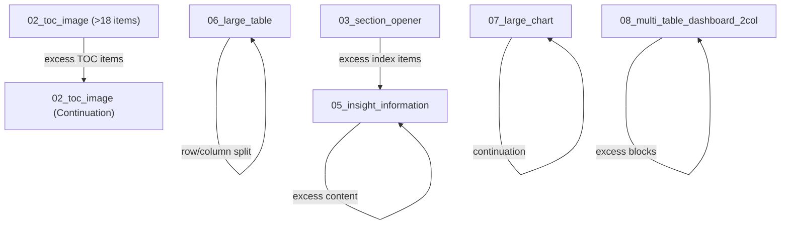
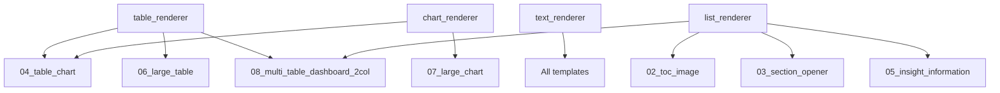

# PPT Generator (Automated Market-Research PowerPoint Generator)

A production-grade, template-driven PowerPoint document layout engine designed to take structured report content (JSON) and generate presentations that faithfully reproduce the visual hierarchy, typography, data density, dynamic tables, charts, and spacing of premium research reports (such as the reference *Mining UGV Market* report).

---

## Final Template Registry

All 8 templates are defined with a consistent schema structure:

| # | Template ID | File | Primary Content | Continuation Target |
|---|---|---|---|---|
| 01 | `01_cover_title_image` | [`01_cover_title_image.json`](assets/templates/mining_ugv/annotations/01_cover_title_image.json) | Cover title, subtitle, metadata & hero visual | — |
| 02 | `02_toc_image` | [`02_toc_image.json`](assets/templates/mining_ugv/annotations/02_toc_image.json) | Diamond-badge TOC, 2-col × 9 items (max 18 items) | `02_toc_image` (Continuation TOC) |
| 03 | `03_section_opener` | [`03_section_opener.json`](assets/templates/mining_ugv/annotations/03_section_opener.json) | Section title + index list + visual | `05_insight_information` |
| 04 | `04_table_chart` | [`04_table_chart.json`](assets/templates/mining_ugv/annotations/04_table_chart.json) | Context note + chart (left) + heading/narrative/table/insight (right) | — |
| 05 | `05_insight_information` | [`05_insight_information.json`](assets/templates/mining_ugv/annotations/05_insight_information.json) | 2-col block containers (paragraphs, bullets, index, insight) | Self (`05_insight_information`) |
| 06 | `06_large_table` | [`06_large_table.json`](assets/templates/mining_ugv/annotations/06_large_table.json) | Title + one dominant table (~1705×902px) | Self (`06_large_table`) |
| 07 | `07_large_chart` | [`07_large_chart.json`](assets/templates/mining_ugv/annotations/07_large_chart.json) | Title + legend + one dominant chart (~1650×650px) | Self (`07_large_chart`) |
| 08 | `08_multi_table_dashboard_2col` | [`08_multi_table_dashboard_2col.json`](assets/templates/mining_ugv/annotations/08_multi_table_dashboard_2col.json) | 2-col dynamic blocks (heading, paragraph, bullet, table, insight, index) | Self (`08_multi_table_dashboard_2col`) |

---

## Overflow / Continuation Graph

Content is never silently truncated, hidden, or shrunken below readable limits. If content exceeds available container height or width, the layout engine splits rows/items or dispatches to continuation slides:



---

## Shared Renderer Architecture

Layout rendering logic is unified across all templates to prevent code duplication and guarantee visual consistency:



---

## Backgrounds

The presentation system separates structural slide geometry from background assets:

| Asset | Metadata | Used By Templates |
|---|---|---|
| `bg_01.png` | [`bg_01.json`](assets/backgrounds/bg_01.json) | `02_toc_image`, `04_table_chart`, `05_insight_information`, `06_large_table`, `07_large_chart`, `08_multi_table_dashboard_2col` |
| `bg_02.png` | [`bg_02.json`](assets/backgrounds/bg_02.json) | `03_section_opener` |
| `bg_03.png` | [`bg_03.json`](assets/backgrounds/bg_03.json) | `01_cover_title_image` |

---

## Schemas

All configurations, template annotations, and content payloads are formally validated via JSON Schema (Draft-07):

| Schema | File | Purpose |
|---|---|---|
| Template Annotation | [`template.schema.json`](schemas/template.schema.json) | Validates template annotations. Region types: text, subtitle, image, table, chart, chart_component, bullet_list, insight, column, container, footer, source, section_label. Geometry: fixed, fixed_anchor, dynamic. |
| Content Input | [`content.schema.json`](schemas/content.schema.json) | Validates slide data payloads (text, table, chart, image, bullet_list, insight). |
| Report Manifest | [`report.schema.json`](schemas/report.schema.json) | Validates full deck manifests (ordered slides, defaults, report metadata). |
| Template Registry | [`template_registry.json`](schemas/template_registry.json) | Master registry mapping template IDs to annotations, backgrounds, and continuation strategies. |

---

## Canonical JSON Top-Level Keys

Every template annotation strictly adheres to this uniform schema:

```json
{
  "template_id": "...",
  "template_name": "...",
  "version": "...",
  "canvas": {},
  "background": {},
  "safe_area": {},
  "regions": {},
  "components": {},
  "layout": {},
  "typography": {},
  "spacing": {},
  "constraints": {},
  "overflow": {},
  "content_model": {}
}
```

---

## Core Engine Architecture

```
ppt-generator/
│
├── assets/
│   ├── backgrounds/               # High-res slide background templates (bg_01, bg_02, bg_03)
│   └── templates/
│       └── mining_ugv/
│           ├── annotations/       # Machine-readable JSON annotations for all 8 templates
│           ├── reference/         # Visual ground-truth reference images
│           └── rendered/          # Slide-by-slide rendered outputs for verification
│
├── schemas/                       # JSON Schemas (template, content, report, registry)
├── layout/                        # Deterministic layout, measurement, & overflow engines
│   ├── coordinate_system.py       # 1920x1080 px to PPTX EMU/inch coordinate mapper
│   ├── text_measurement.py        # Font-aware deterministic text measuring & wrapping
│   ├── table_layout.py            # Dynamic table row/col sizing, cell wrapping & splitting
│   ├── chart_layout.py            # Dynamic chart plot sizing & label positioning
│   ├── stack_layout.py            # Vertical stack layout with spacing compaction
│   └── overflow_engine.py         # Multi-phase overflow resolution & continuation logic
│
├── renderer/                      # PowerPoint element rendering layer (python-pptx)
│   ├── powerpoint_renderer.py     # Main deck assembler and PPTX generator
│   ├── template_renderer.py       # Slide-level template executor
│   ├── text_renderer.py           # Headings, paragraphs, index lists, TOC badges
│   ├── table_renderer.py          # Native editable PowerPoint tables
│   ├── chart_renderer.py          # Native editable PowerPoint charts (bar, line, pie)
│   ├── image_renderer.py          # Image placement with aspect ratio handling
│   └── component_renderer.py      # Reusable visual components (badges, cards, insights)
│
├── validators/                    # Quality assurance & compliance validators
│   ├── geometry_validator.py      # Boundary and safe-area enforcement
│   ├── text_validator.py          # Text clipping & font constraint checks
│   ├── table_validator.py         # Cell clipping & overflow checks
│   ├── chart_validator.py         # Chart label & plot area validation
│   └── completeness_validator.py  # Verifies 100% of input content was rendered
│
├── examples/                      # Synthetic reports and test datasets (simple to edge cases)
├── tests/                         # Unit and integration test suites
└── output/                        # Generated presentations (.pptx)
```

---

## Installation & Requirements

- Python 3.10+
- Dependencies: `python-pptx`, `jsonschema`, `pillow`, `matplotlib` (optional visual diffs), `pytest`

```bash
pip install python-pptx jsonschema pillow pytest
```

---

## CLI Usage

Generate presentation from report manifest:
```bash
python -m ppt_generator generate --input examples/report.json --output output/report.pptx
```

Validate report payload without generating:
```bash
python -m ppt_generator validate --input examples/report.json
```

Render single template with test payload:
```bash
python -m ppt_generator render-template --template-id 06_large_table --input examples/large_table.json --output output/test.pptx
```
