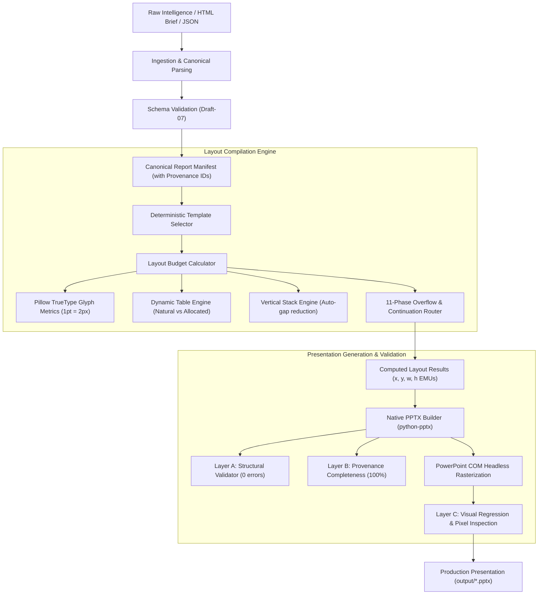

# PPT Generator V1
### Enterprise Document Synthesis & Strategic Presentation Engine

[](LICENSE)
[](https://www.python.org/)
[](tests/)
[](output/)
[](README.md)

A deterministic, template-driven presentation layout engine engineered to transform complex market intelligence, econometric datasets, and executive briefs into publication-grade, C-suite presentations adhering to tier-1 strategy consulting standards (McKinsey, BCG, Bain).

Built around **8 canonical layout archetypes**, a **mathematical text and table layout budgeter**, **dynamic continuation engines**, and a **dual-phase structural and visual verification pipeline**.

---

## Executive Summary & Core Capabilities

Traditional automated PowerPoint tools rely on fragile heuristic positioning, resulting in overlapping text boxes, clipped tables, unreadable font shrinkages, and lost data. 

**PPT Generator V1** treats slide synthesis as a deterministic layout compilation problem:
1. **Mathematical Layout Budgeting:** Font metrics and bounding boxes are measured using TrueType font glyph analysis at native canvas scale ($1\text{ pt} = 2.0\text{ px}$ on a 16:9 1920×1080 canvas), predicting text wrapping and collision *before* rendering.
2. **Zero-Content-Loss Guarantee:** Every data point, table cell, bullet item, and narrative paragraph is assigned a persistent provenance ID. The pipeline validates that $100\%$ of input items exist in the output deck with zero silent drops.
3. **Graceful Overflow Routing:** When data density exceeds slide capacity, the engine applies an 11-phase priority hierarchy—rebalancing columns, adjusting gaps, and automatically generating continuation slides.
4. **Strict Consulting Aesthetic Standard:** Standardized typography tokens, high-contrast dark navy `#0D3166` palettes, alternating row shading, card elevation with drop shadows, and diamond-badge indexes.

---

## Architectural Workflow



---

## The 8 Canonical Layout Archetypes

The engine implements 8 specialized slide archetypes derived from institutional market research and strategy decks:

| # | Archetype ID | Layout Pattern & Canvas Role | Background Asset | Safe Area (px) | Overflow / Continuation Target |
|---|---|---|---|---|---|
| **01** | `01_cover_title_image` | Cover slide: Title (36pt), subtitle, metadata, hero motif | `bg_03.png` | 83×48, 1810×930 | Single slide terminal |
| **02** | `02_toc_image` | Table of Contents: Diamond badge numbers, 2-col balanced | `bg_02.png` | 83×48, 1810×930 | Split $\rightarrow$ `02_toc_image` (Continuation) |
| **03** | `03_section_opener` | Section Opener: Header + numbered subsection agenda | `bg_01.png` | 105×80, 1150×820 | Overflow $\rightarrow$ `05_insight_information` |
| **04** | `04_table_chart` | Executive Summary: Dual column (chart left, table + insight right) | `bg_02.png` | 83×48, 1810×930 | Column-clamped terminal |
| **05** | `05_insight_information` | Narrative & Synthesis: 2-column dynamic stacking blocks | `bg_02.png` | 83×48, 1810×930 | Split $\rightarrow$ `05_insight_information` |
| **06** | `06_large_table` | Master Data Grid: Full canvas data table with header lock | `bg_02.png` | 83×48, 1810×930 | Split $\rightarrow$ `06_large_table` (Row pagination) |
| **07** | `07_large_chart` | High-Resolution Chart: Full-canvas timeseries / category plot | `bg_02.png` | 83×48, 1810×930 | Split $\rightarrow$ `07_large_chart` |
| **08** | `08_multi_table_dashboard_2col` | Multi-Metric Dashboard: Multi-table comparison & analytics | `bg_02.png` | 83×48, 1810×930 | Split $\rightarrow$ `08_multi_table_dashboard_2col` |

### Strict Background Asset Standards
- **`bg_01.png`**: Reserved **exclusively** for Section Opener slides (`03_section_opener`), featuring a crisp white left content area and institutional blue diagonal geometric bands on the right.
- **`bg_02.png`**: Standardized for **all content slides** (TOC, Tables, Charts, Insights, Dashboards), presenting an unobstructed white canvas framed by a deep navy institutional border.
- **`bg_03.png`**: Reserved **exclusively** for Cover Title slides (`01_cover_title_image`).

---

## Project Structure

```
sampleGenerator/
├── assets/
│   ├── backgrounds/                     # Background image assets & metadata
│   │   ├── bg_01.png                    # Section Opener background
│   │   ├── bg_02.png                    # Content Slide background
│   │   ├── bg_03.png                    # Cover Slide background
│   │   └── *.json                       # Background dimension & margin manifests
│   └── templates/mining_ugv/
│       ├── annotations/                 # Canonical coordinate annotations (01-08)
│       └── reference/                   # Ground-truth reference render benchmarks
├── config/
│   └── theme.py                         # Corporate design tokens & color palettes
├── layout/
│   ├── budget_calculator.py             # Spatial budget evaluator
│   ├── coordinate_system.py             # Canvas (1920x1080) to PowerPoint EMU/Inches converter
│   ├── overflow_engine.py               # 11-phase overflow & continuation resolver
│   ├── stack_layout.py                  # Dynamic vertical column stacking engine
│   ├── table_layout.py                  # Natural vs allocated row height & column sizer
│   └── text_measurement.py              # Pillow TrueType glyph metric calculator
├── models/
│   ├── report_model.py                  # Strongly-typed dataclasses & provenance model
│   └── template_selector.py             # Rule-based archetype matcher
├── ppt_generator/
│   ├── __main__.py                      # CLI runner entrypoint
│   └── cli.py                           # Command-line interface
├── renderer/
│   ├── chart_renderer.py                # Native PowerPoint chart builder (bar, column, line)
│   ├── component_renderer.py            # Generic component dispatcher
│   ├── image_renderer.py                # High-DPI background & image renderer
│   ├── list_renderer.py                 # Diamond TOC badges & bullet lists
│   ├── powerpoint_renderer.py           # Native PPTX presentation builder
│   ├── rasterizer.py                    # Windows COM PowerPoint headless rasterizer
│   ├── table_renderer.py                # Styled data table renderer (zebra striping, headers)
│   ├── template_renderer.py             # Archetype layout compiler
│   └── text_renderer.py                 # Typography renderer with strict word-wrap
├── schemas/                             # JSON Schema (Draft-07) definitions
│   ├── content.schema.json
│   ├── report.schema.json
│   ├── template.schema.json
│   └── template_registry.json
├── tests/
│   ├── test_stress_cases.py             # 19 comprehensive stress & edge-case test suites
│   └── test_email_pipeline.py           # HTML email parser, chart analyzer & API tests
├── html_parser.py                       # Generic fault-tolerant Gmail HTML email parser
├── chart_analyzer.py                    # Table graph-worthiness detection & auto-chart generator
├── api_server.py                        # FastAPI REST API server (/parse, /generate, /pipeline)
├── build_email_report_json.py           # Mining UGV specific ingestion script
├── pyproject.toml                       # Build system & package metadata
├── requirements.txt                     # Production & development dependencies
└── LICENSE                              # MIT License
```

---

## Installation & Setup

### Prerequisites
- Python 3.10 or higher
- Windows OS (with Microsoft PowerPoint installed) for optional headless COM slide rasterization.

### Setup
```bash
# Clone the repository
git clone https://github.com/Sri-Ranga9989/sampleGenerator.git
cd sampleGenerator

# Create and activate virtual environment
python -m venv env
.\env\Scripts\activate

# Install dependencies
pip install -r requirements.txt
```

---

## CLI Usage Guide

PPT Generator V1 provides a unified command-line tool with built-in HTML ingestion and server capabilities:

### 1. Ingest & Parse Arbitrary Gmail HTML Email
Parses market-research Gmail HTML exports, extracts all sections and tables into canonical JSON, and auto-detects graph-worthy tables:
```bash
python -m ppt_generator parse-html --input "Gmail - Fwd_ Automated Guided Forklifts Market.html" --output output/agf/report.json
```
Use `--no-auto-charts` to disable automatic chart generation.

### 2. Validate Input Manifest
Validates input JSON schema adherence and Canonical Data Model integrity:
```bash
python -m ppt_generator validate-input --input examples/mining_ugv_email_report.json
```

### 3. Generate Presentation Deck
Executes the full 5-phase pipeline: Layout Computation $\rightarrow$ PPTX Generation $\rightarrow$ Layer A Structural Validation $\rightarrow$ Provenance Completeness Check $\rightarrow$ Headless COM Slide Rasterization:
```bash
python -m ppt_generator generate --input output/agf/report.json --output output/agf/report.pptx --no-rasterize
```

### 4. Validate PPTX Presentation Structure
Inspects generated `.pptx` decks for shape boundary compliance, font size clamps, and layout violations:
```bash
python -m ppt_generator validate-pptx --input output/agf/report.pptx
```

### 5. Launch FastAPI Microservice
Starts the production FastAPI server for HTTP-driven ingestion and presentation generation:
```bash
python -m ppt_generator serve --port 8050
```

---

## REST API Endpoints

The API server (`api_server.py`) provides three primary endpoints:

| Endpoint | Method | Input | Output / Description |
|:---|:---|:---|:---|
| `/parse` | `POST` | `multipart/form-data` (HTML file) | Returns canonical JSON manifest with parsing statistics |
| `/generate` | `POST` | `multipart/form-data` (JSON file) | Generates and downloads native `.pptx` presentation |
| `/pipeline` | `POST` | `multipart/form-data` (HTML file) | Full end-to-end: HTML upload $\rightarrow$ PPTX download |
| `/health` | `GET` | None | Service health status and timestamp |

---

## Quality Assurance & Verification

The test suite validates extreme data density and stress conditions across 19 critical edge cases:

```bash
python -m pytest -v
```

### Stress Test Coverage:
- **Case 1:** Huge explanatory table cells (independent row expansion without stretching adjacent rows).
- **Case 2:** Long wrapped bullet items in narrow multi-column layouts.
- **Case 3:** High-item section index overflow ($>15$ items routing dynamically to `05_insight_information`).
- **Case 4:** Dominant large tables with high row counts ($>30$ rows cleanly paginated across slides).
- **Case 5:** Wide multi-column tables ($>10$ columns with proportional column width optimization).
- **Case 6:** Extreme chart category density ($>15$ series with rotated labels and legible spacing).
- **Case 7:** Dynamic multi-table dashboard with disparate column counts.
- **Case 8:** Zero-margin and safe-area collision boundaries.
- **Case 9:** Title and subtitle vertical collision prevention with dynamic line wrapping.
- **Case 10:** Table cell text wrapping bounds.
- **Case 11:** Sparse slide content handling without formatting collapse.
- **Case 12:** Unicode, mathematical symbols, and multi-currency formatting (`€`, `¥`, `£`, `±`, `µm`).
- **Cases 13–19:** 100% item completeness provenance tracking across all archetypes.

---

## License

This project is licensed under the MIT License — see the [LICENSE](LICENSE) file for details.
