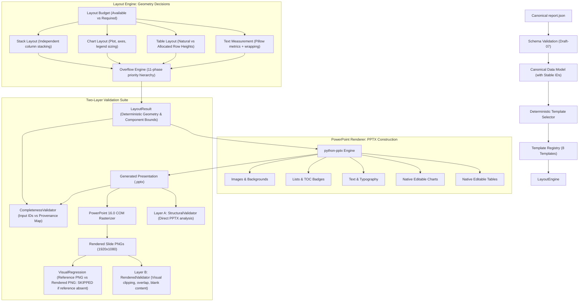

# Revised Implementation Plan: PPT Generator V1

A production-quality, template-driven document layout and PowerPoint presentation engine built on the 8 layout archetypes established in the *Mining UGV Market* report.

---

## Architecture & Foundational Principles



---

## 7 Core Architectural Mandates Incorporated

1. **Strict Reference vs. Rendered Directory Roles:**
   - `assets/templates/mining_ugv/reference/`: Authoritative ground truth reference PNGs.
   - `assets/templates/mining_ugv/rendered/`: Generated slide PNG outputs from the engine.
   - `assets/templates/mining_ugv/diff/`: Visual difference artifacts.
   - *Status:* If reference images are not present, visual regression returns `SKIPPED` (never a false "PASSED").

2. **Exact 13 Canonical Top-Level Schema Keys:**
   All 8 template annotations strictly adhere to these exact 13 keys:
   ```text
   1.  template_id
   2.  template_name
   3.  version
   4.  canvas
   5.  background
   6.  safe_area
   7.  regions
   8.  components
   9.  typography
   10. spacing
   11. constraints
   12. overflow
   13. content_model
   ```
   *Note:* The redundant/empty `layout` key is removed, and `components` is retained as key #8.

3. **Two-Level Text Measurement & Validation:**
   - *Level 1 (Pre-render measurement):* Pillow `ImageFont` metrics calculate `natural_width`, `natural_height`, and `line_count` to drive the layout engine.
   - *Level 2 (Actual rendered validation):* Native Microsoft PowerPoint 16.0 COM rasterizes the PPTX slides into 1920×1080 PNGs to visually detect text clipping, boundary overruns, and font rendering discrepancies.

4. **Two-Layer Validation Architecture:**
   - **Layer A (`StructuralValidator`):** Evaluates python-pptx shape boundaries, slide dimensions, minimum font sizes, table/chart dimensions, illegal overlaps, and content IDs.
   - **Layer B (`RenderedValidator`):** Analyzes rasterized slide images for visual clipping, visual overlaps, blank content boxes, and unexpected overflow.

5. **Stable Content IDs & Deterministic Completeness Tracking:**
   - Every input content block must have or be assigned a deterministic stable ID (`id`), e.g., `sec_02_sub_07`, `tbl_04_row_07_col_03`, `bullet_007`.
   - The rendering pipeline emits a provenance map:
     $$\text{Input ID} \longrightarrow (\text{Slide Number}, \text{Component Type}, \text{Shape ID})$$
   - Completeness is verified via exact set difference:
     $$\text{Missing Content} = \text{Input IDs} \setminus \text{Rendered Output IDs}$$

6. **Decoupled `LayoutResult` Intermediate Representation:**
   - Pure separation of concerns:
     - `LayoutEngine`: Determines exact geometries, font sizes, line wrapping, and splits.
     - `LayoutResult`: Contains slide bounds, region geometry, component positions, and overflow statuses.
     - `PowerPointRenderer`: Reads `LayoutResult` and creates PowerPoint shapes without making layout or sizing decisions.

7. **Natural vs. Allocated Dimensions & Universal Layout Budget:**
   - Every region has a budget: $(\text{available\_width}, \text{available\_height})$.
   - Every block calculates its requirement: $(\text{required\_width}, \text{required\_height})$.
   - **Tables:** Distinguish `natural_row_height` from `allocated_row_height = max(natural_height, minimum_height)`. A single long explanatory cell expands *only* its specific row; short rows remain compact.

---

## Explicit Overflow Resolution Hierarchy

When $\text{required} > \text{available}$, the shared overflow engine resolves the budget deficit deterministically using this exact priority order:

1. **Natural Layout:** Check if content fits with preferred typography and spacing.
2. **Remove Unnecessary Whitespace:** Trim redundant top/bottom margins.
3. **Reduce Block Spacing:** Progressively reduce inter-block gaps down to `minimum_item_gap`.
4. **Optimize Dimensions:** Expand region within safe-area boundaries if adjacent space allows.
5. **Optimize Table Column Widths:** Reallocate column widths based on content density.
6. **Optimize Chart Margins:** Compact plot padding and axis label offsets.
7. **Reduce Font Size Within Limits:** Decrement font size step-by-step from preferred to `minimum_font_size` (never below minimum).
8. **Rebalance Columns:** For two-column layouts (TOC 02, Information 05, Dashboard 08), redistribute items evenly.
9. **Split Content:** Split table rows or list items at natural boundaries.
10. **Continuation Slide:** Spawn continuation slide (e.g. `03_section_opener` $\rightarrow$ `05_insight_information`, `06` $\rightarrow$ `06`, `08` $\rightarrow$ `08`).
11. **Fail Validation:** If content cannot fit even after continuation/splitting without violating rules.

> [!IMPORTANT]
> **Global Invariant:** Never crop text, never hide content, never truncate table rows, never silently delete bullets or categories, and never summarize data.

---

## 10-Phase Implementation Roadmap

### Phase 0: Repository & Asset Verification
- Inspect and verify 3 background assets (`bg_01.png`, `bg_02.png`, `bg_03.png`).
- Verify reference folder status (`assets/templates/mining_ugv/reference/`).
- Standardize all 8 template annotations to the exact 13 canonical keys.
- Complete `01_cover_title_image.json` annotation (using `bg_03.png`, left title region, right hero visual).
- Update `schemas/template.schema.json` to enforce the 13 canonical keys.
- Create `schemas/template_registry.json`.

### Phase 1: Foundations & Design Tokens
- Centralize coordinate system (`layout/coordinate_system.py`) for 1920×1080 px $\leftrightarrow$ Inches/EMU.
- Centralize design tokens and theme (`config/theme.py`) extracted from reference assets (colors, fonts, chart palettes).
- Define canonical `Report` data model and ingestion parser (`models/report_model.py`) with stable ID assignment.
- Implement template selector (`models/template_selector.py`).

### Phase 2: Measurement Engine & Layout Budget
- Implement `layout/layout_budget.py`: Budget management (`available` vs `required`).
- Implement `layout/text_measurement.py`: Deterministic font metrics, multiline wrapping, line count, height calculation.
- Implement `layout/table_layout.py`: Content-aware column width balancing, independent cell measurement, `natural_row_height` vs `allocated_row_height`.
- Implement `layout/chart_layout.py`: Plot area sizing, margins, legend and axis clearance for bar, line, and pie.
- Implement `layout/stack_layout.py`: Dynamic vertical stacking for independent 2-column layouts.
- Implement `layout/layout_result.py`: Structured dataclasses defining the rendered geometry contract.

### Phase 3: Centralized Overflow Engine
- Implement `layout/overflow_engine.py`: Multi-step resolution pipeline (spacing $\rightarrow$ font reduction $\rightarrow$ rebalancing $\rightarrow$ row/item splitting $\rightarrow$ continuation slide generation).
- Implement continuation routing based on `schemas/template_registry.json`.

### Phase 4: Shared PowerPoint Renderers
- `renderer/image_renderer.py`: Full-slide background placement and aspect-ratio preserved hero images.
- `renderer/text_renderer.py`: Headings, paragraphs, context notes, and insights formatted with typography tokens.
- `renderer/list_renderer.py`: TOC items (diamond shape badges with centered numbers and wrapping labels), index items, bullet lists.
- `renderer/table_renderer.py`: Native python-pptx editable tables styled with cell margins, alternating fills, and borders.
- `renderer/chart_renderer.py`: Native python-pptx editable charts (Bar, Line, Pie) with unified theme palette.
- `renderer/component_renderer.py`: Dispatcher for reusable components (`toc_item`, `index_item`, `insight_block`).
- `renderer/powerpoint_renderer.py`: Takes `LayoutResult` sequence and produces native `.pptx` decks while recording the provenance map.

### Phase 5: Implement All 8 Templates
- Individual template drivers translating template annotations + data into layout requests:
  - `01_cover_title_image`
  - `02_toc_image`
  - `03_section_opener`
  - `04_table_chart`
  - `05_insight_information`
  - `06_large_table`
  - `07_large_chart`
  - `08_multi_table_dashboard_2col`

### Phase 6: Phase 0.5 — Individual Template Calibration
- Render each template individually with canonical reference content.
- Rasterize each slide to PNG via native PowerPoint 16.0 COM (`win32com.client`).
- Output slides to `assets/templates/mining_ugv/rendered/`.
- Validate geometry, visual hierarchy, and alignment for each archetype before report-level generation.

### Phase 7: Two-Layer Validation Suite
- `validators/structural_validator.py` (Layer A): Checks PPTX shapes, boundaries, overlaps, safe area compliance.
- `validators/rendered_validator.py` (Layer B): Inspects rasterized PNGs for visual clipping and overflow.
- `validators/completeness_validator.py`: Verifies $\text{Input IDs} = \text{Output IDs}$ using the provenance map.
- `validators/visual_regression.py`: Compares rendered PNG against reference PNG if present, returns `SKIPPED` if absent.

### Phase 8: Stress Testing Suite
- Test 19 edge cases specified in Section 36:
  - Long table with one huge explanatory cell (verifies row-specific expansion).
  - Many TOC items (dynamic capacity calculation, no clipping, continuation).
  - Many section index items (overflow to `05_insight_information`).
  - Dominant tables with high column count and row splitting.
  - Dominant charts with many categories.
  - Multi-table dashboards with varied block heights.

### Phase 9: Full End-to-End Report Generation
- Load full *Mining UGV Market* report manifest.
- Execute full pipeline: Parse $\rightarrow$ Measure $\rightarrow$ Layout $\rightarrow$ Overflow $\rightarrow$ Render PPTX $\rightarrow$ Rasterize PNGs $\rightarrow$ Validate Structural & Rendered $\rightarrow$ Verify Completeness.
- Save final report to `output/mining_ugv_report.pptx`.

### Phase 10: CLI, Documentation & Git Push
- Expose complete CLI commands:
  - `python -m ppt_generator validate-input --input <file.json>`
  - `python -m ppt_generator validate-pptx --input <file.pptx>`
  - `python -m ppt_generator render-template --template-id <id> --input <file.json> --output <file.pptx>`
  - `python -m ppt_generator generate --input <file.json> --output <file.pptx>`
  - `python -m ppt_generator compare --reference <ref.png> --generated <gen.png>`
- Update `README.md` and commit all progress to GitHub.
