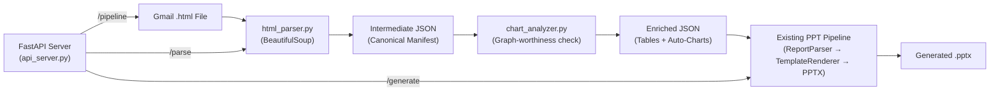

# HTML Email → PPT Pipeline: Automated Parsing & API Endpoints

Build a fault-tolerant pipeline that ingests arbitrary market-research Gmail HTML emails, parses **every** section and table into the canonical JSON manifest, auto-detects graph-worthy tables and injects chart slides, and exposes FastAPI endpoints for triggering the full workflow.

---

## Architecture Overview



---

## User Review Required

> [!IMPORTANT]
> **Minimal changes to existing code.** The parser and API layer are entirely **new files**. The only existing file that may need a minor tweak is `cli.py` (to add `parse-html` and `serve` commands). The core engine (`report_model.py`, `template_renderer.py`, `powerpoint_renderer.py`, layout modules) remain untouched.

> [!WARNING]
> **Chart auto-detection heuristic.** The system will analyze each table to determine if a chart can be generated. A table is considered "graph-worthy" if it has:
> - ≥2 numeric columns (values like `$4.7 Bn`, `12.8%`, `~34,000`)
> - ≥3 data rows
> - A clear categorical first column (text labels)
> 
> When a table qualifies, a chart slide is automatically inserted **immediately after** the table slide. You can override this with a `--no-auto-charts` flag.

---

## Open Questions

> [!IMPORTANT]
> 1. **Port for the API server** — defaulting to `8050` (to prevent conflicts with services like Splunk).
> 2. **Authentication on endpoints** — None for V1 (local use only). Acceptable?
> 3. **Output directory convention** — Each run creates `output/<report_slug>/report.pptx`. OK?

---

## Proposed Changes

### HTML Parser Component

#### [NEW] [html_parser.py](file:///d:/sidequest/sampleGenerator/html_parser.py)

A robust, fault-tolerant HTML email parser that:

1. **Strips Gmail wrapper** — Identifies the forwarded message body, ignoring Gmail chrome (header tables, logos, metadata).
2. **Detects document structure** — Parses `<h1>` as report title, `<h3>` with numbered patterns (`1. xxx`, `2. xxx`) as sections, `<h2>` as section data headings.
3. **Extracts all tables** — Iterates every `<table>` that is NOT a Gmail wrapper (detection via column count, absence of data patterns).
4. **Parses table of contents** — Detects `<p>` blocks containing numbered sub-section listings (`1.1 xxx\n1.2 xxx\n...`).
5. **Extracts commentary/insight text** — `<p>` blocks between tables become insight blocks with contextual titles.
6. **Builds canonical JSON manifest** — Outputs the exact same schema as `examples/mining_ugv_full_email_report.json`.

Key fault-tolerance features:
- **Try/except per section** — A malformed section doesn't crash the entire parse; it's logged and skipped.
- **Table header auto-detection** — Falls back to first row as header if `<thead>` is absent.
- **Unicode normalization** — Handles `\xa0`, `—`, `→`, etc.
- **Empty table/row filtering** — Silently drops completely empty rows/tables.

---

### Chart Analysis Component

#### [NEW] [chart_analyzer.py](file:///d:/sidequest/sampleGenerator/chart_analyzer.py)

Analyzes each parsed table and determines:

1. **Is this table graph-worthy?** — Checks for numeric columns (parses `$4.7 Bn`, `12.8%`, `~34,000` patterns), minimum row count, and categorical label column.
2. **What chart type is best?**
   - Time-series data (Year columns) → **Line chart**
   - Share/percentage data → **Pie chart** (if single numeric column) or **Stacked bar**
   - Comparison data → **Clustered bar chart**
3. **Generates chart block** — Creates a `ChartBlock`-compatible dict with extracted numeric values, categories, and series names.

The analyzer is called during manifest building. For each table that qualifies, a chart entry is injected as a separate slide immediately after the table slide.

---

### API Server

#### [NEW] [api_server.py](file:///d:/sidequest/sampleGenerator/api_server.py)

FastAPI server exposing three endpoints:

| Endpoint | Method | Input | Output |
|:---|:---|:---|:---|
| `/parse` | `POST` | HTML file upload | JSON manifest |
| `/generate` | `POST` | JSON manifest (file or body) | PPTX file download |
| `/pipeline` | `POST` | HTML file upload | PPTX file download |

Each endpoint returns structured JSON responses with:
- `status`: `"success"` or `"error"`
- `output_path`: Path to generated file
- `stats`: Table count, section count, slide count, chart count
- `warnings`: List of non-fatal parsing issues

Additional endpoints:
- `GET /health` — Health check
- `GET /stats/{run_id}` — Retrieve stats for a previous run

---

### CLI Integration

#### [MODIFY] [cli.py](file:///d:/sidequest/sampleGenerator/ppt_generator/cli.py)

Add two new subcommands:

```
python -m ppt_generator parse-html --input <email.html> --output <report.json> [--no-auto-charts]
python -m ppt_generator serve [--port 8050]
```

This avoids modifying any existing commands — purely additive.

---

### Output Directory

#### [NEW] `output/<report_slug>/`

Each pipeline run creates:
- `report.json` — Intermediate canonical manifest
- `report.pptx` — Generated presentation
- `stats.json` — Run statistics (sections, tables, charts, slides, warnings)

---

## File Summary

| File | Status | Purpose |
|:---|:---|:---|
| `html_parser.py` | **NEW** | Gmail HTML → canonical JSON manifest |
| `chart_analyzer.py` | **NEW** | Table graph-worthiness detection + chart block generation |
| `api_server.py` | **NEW** | FastAPI server with `/parse`, `/generate`, `/pipeline` |
| `ppt_generator/cli.py` | **MODIFY** | Add `parse-html` and `serve` subcommands |
| `requirements.txt` | **MODIFY** | Add `fastapi`, `uvicorn`, `python-multipart` |

---

## Verification Plan

### Automated Tests

```bash
# 1. Parse the Automated Guided Forklifts email
python html_parser.py "Gmail - Fwd_ Automated Guided Forklifts Market.html" --output output/agf_test/report.json

# 2. Verify JSON manifest integrity
python -m ppt_generator validate-input --input output/agf_test/report.json

# 3. Generate PPT from parsed manifest
python -m ppt_generator generate --input output/agf_test/report.json --output output/agf_test/report.pptx --no-rasterize

# 4. Validate generated PPT
python -m ppt_generator validate-pptx --input output/agf_test/report.pptx
```

### Manual Verification

- Open `report.json` and verify every section/table from the HTML is represented
- Open `report.pptx` in PowerPoint and visually confirm:
  - All 37 sections have corresponding slides
  - All ~30 data tables are rendered
  - Auto-generated charts appear after graph-worthy tables
  - No blank or corrupted slides
- Test the API endpoints via browser or curl

### Chart Detection Verification

- Count the tables flagged as graph-worthy
- Verify chart type selection matches data structure (time-series → line, shares → pie/bar)
- Confirm chart data values match the source table
