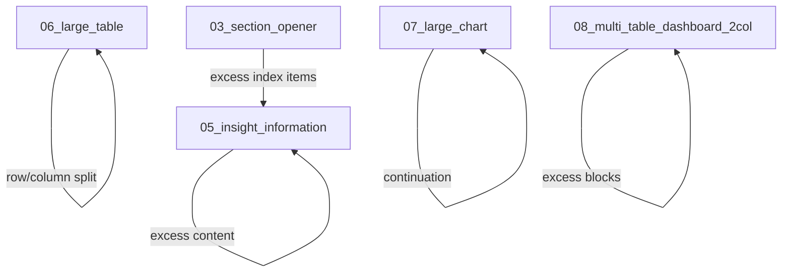
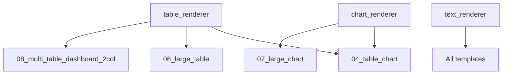

# PPT Generator — Template Registry Complete

## Final Registry

All 8 templates are now fully annotated with consistent structure.

| # | Template ID | File | Primary content | Continuation target |
|---|---|---|---|---|
| 01 | `01_cover_title_image` | [`01_cover_title_image.json`](file:///d:/sidequest/sampleGenerator/assets/templates/mining_ugv/annotations/01_cover_title_image.json) | ⬜ skeleton | — |
| 02 | `02_toc_image` | [`02_toc_image.json`](file:///d:/sidequest/sampleGenerator/assets/templates/mining_ugv/annotations/02_toc_image.json) | Diamond-badge TOC, 2-col × 9 items | — |
| 03 | `03_section_opener` | [`03_section_opener.json`](file:///d:/sidequest/sampleGenerator/assets/templates/mining_ugv/annotations/03_section_opener.json) | Section title + index list + visual | `05_insight_information` |
| 04 | `04_table_chart` | [`04_table_chart.json`](file:///d:/sidequest/sampleGenerator/assets/templates/mining_ugv/annotations/04_table_chart.json) | Chart (left) + heading/narrative/table/insight (right) | — |
| 05 | `05_insight_information` | [`05_insight_information.json`](file:///d:/sidequest/sampleGenerator/assets/templates/mining_ugv/annotations/05_insight_information.json) | 2-col block containers (paragraphs, bullets, index, insight) | Self |
| 06 | `06_large_table` | [`06_large_table.json`](file:///d:/sidequest/sampleGenerator/assets/templates/mining_ugv/annotations/06_large_table.json) | Title + one dominant table (~1705×902px) | Self |
| 07 | `07_large_chart` | [`07_large_chart.json`](file:///d:/sidequest/sampleGenerator/assets/templates/mining_ugv/annotations/07_large_chart.json) | Title + legend + one dominant chart (~1650×650px) | Self |
| 08 | `08_multi_table_dashboard_2col` | [`08_multi_table_dashboard_2col.json`](file:///d:/sidequest/sampleGenerator/assets/templates/mining_ugv/annotations/08_multi_table_dashboard_2col.json) | 2-col dynamic blocks (heading, paragraph, bullet, table, insight, index) | Self |

## Overflow / Continuation Graph



## Shared Renderer Architecture



## Backgrounds

| Asset | Metadata | Used by |
|---|---|---|
| `bg_01.png` | [`bg_01.json`](file:///d:/sidequest/sampleGenerator/assets/backgrounds/bg_01.json) | 02, 04, 05, 06, 07, 08 |
| `bg_02.png` | [`bg_02.json`](file:///d:/sidequest/sampleGenerator/assets/backgrounds/bg_02.json) | 03 |
| `bg_03.png` | needs metadata | 01 (TBD) |

## Schemas

| Schema | Purpose |
|---|---|
| [`template.schema.json`](file:///d:/sidequest/sampleGenerator/schemas/template.schema.json) | Validates all annotation files. Region types: text, subtitle, image, table, chart, chart_component, bullet_list, insight, column, container, footer, source, section_label. Geometry: fixed, fixed_anchor, dynamic. |
| [`content.schema.json`](file:///d:/sidequest/sampleGenerator/schemas/content.schema.json) | Validates slide data payloads (text, table, chart, image, bullet_list, insight) |
| [`report.schema.json`](file:///d:/sidequest/sampleGenerator/schemas/report.schema.json) | Validates full deck manifests |

## Canonical JSON Top-Level Keys

Every template annotation uses exactly these keys:

```
template_id, template_name, version, canvas, background, safe_area,
regions, components, layout, typography, spacing, constraints,
overflow, content_model
```

## What's Next

The template definitions are complete. The next phase is building the rendering engine:

1. **`table_renderer`** — shared across 04, 06, 08
2. **`chart_renderer`** — shared across 04, 07
3. **`text_renderer`** — shared across all templates
4. **Measurement/overflow engine** — calculates whether content fits and triggers continuation/split logic
5. **Template 01 annotation** — pending reference image spec
